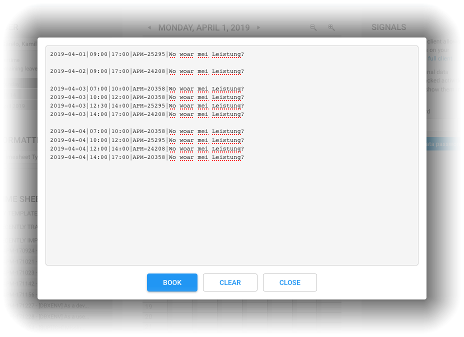

# Dynatrace working time tracking via Excel spreadsheet

from 2019-04-01 on you'll **need two things**:
- my [**Excel spreadsheet**](./spreadsheet/spreadsheet_template_de_v17.xlsx) v17+ to track your working times easily
- my **bookmarklet** to book your times from the spreadsheet to Timecockpit

## How to

1. download the latest spreadsheet and migrate your data from the old one

2. create a bookmark in your browser with the following code as location/url (this is the bookmarklet):
```
javascript:void%20function(){var%20e=document.createElement(%22script%22);e.src=%22https://kamilsarelo.github.io/com.dynatrace.timetracking.bookmarklet.js%3Fq=%22+(new%20Date).getTime(),e.type=%22text/javascript%22,e.onreadystatechange=e.onload=function(){var%20t=e.readyState;t%26%26%22loaded%22!==t%26%26%22complete%22!==t%26%26alert(%22could%20not%20load%20bookmarklet%22)},document.head.appendChild(e)}();
```

3. click the bookmarklet to use it
(will forward to Timecockpit first if not open yet, then click the bookmarklet again to use it)

4. copy the Timecockpit-relevant strings from the latest spreadsheet:


5. paste the copied strings into the bookmarklet's window:


6. click BOOK and lean back
